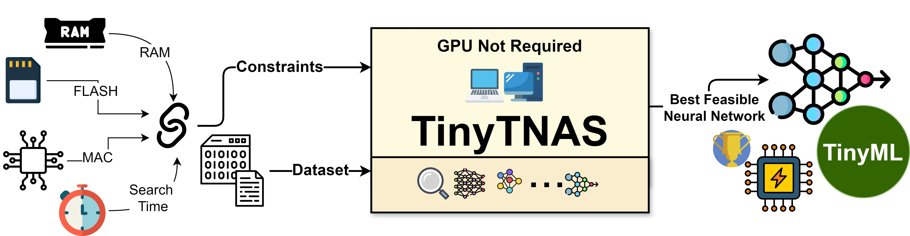
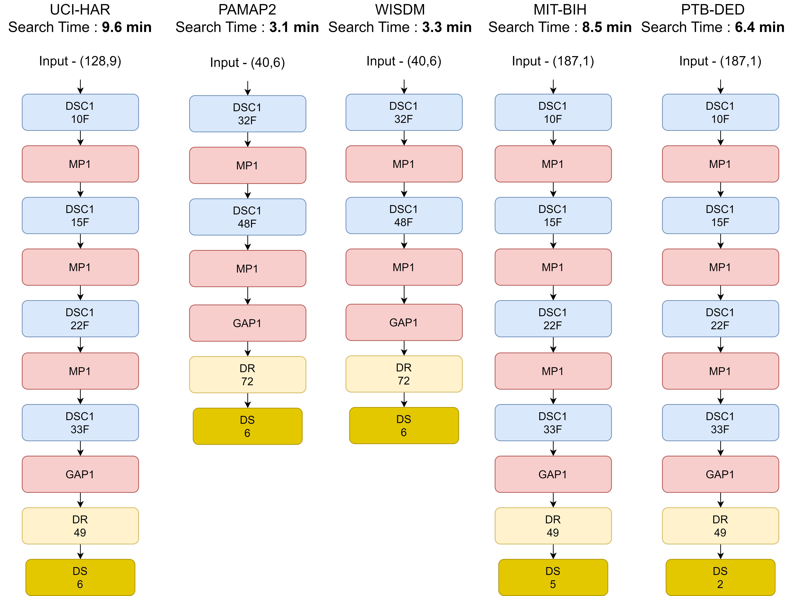

# TinyTNAS: GPU-Free, Time-Bound, Hardware-Aware Neural Architecture Search for TinyML Time Series Classification

## 📄 Overview


**TinyTNAS** is a **hardware-aware, multi-objective Neural Architecture Search (NAS) tool** designed for TinyML time series classification. Unlike GPU-based NAS methods, **it runs efficiently on CPUs**. Users can set constraints on RAM, flash, and MAC operations to discover optimal neural network architectures. Additionally, **TinyTNAS supports time-bound searches** to find the best model within a specified timeframe.

<div style="text-align: center;">
  
  <p><em>Fig. 1 : Conceptual Diagram of TinyTNAS</em></p>
</div>

## 📄 Paper Link

For more detailed information, you can read our full paper:

[TinyTNAS: GPU-Free, Time-Bound, Hardware-Aware Neural Architecture Search for TinyML Time Series Classification](https://arxiv.org/abs/2408.16535)


## 📑  Table of Contents 
- [Features](#features)
- [Installation](#installation)
- [Dataset](#dataset)
- [Usage](#usage)
- [Performance Summary](#performance-summary)
- [Contributors](#contributors)
- [License](#license)
- [Citation](#citation)
- [Contact](#contact)


<h2 id="features">🚀 Features</h2>


- **GPU-Free Search**: Search neural architectures without relying on GPUs, making it accessible to a wider range of users.
- **Time-Bound Searches**: Ensures that architecture searches are completed within a specified time frame.
- **Hardware-Aware Design**: Tailors the neural network design to the specific hardware constraints of TinyML devices.
- **Applicable to Time Series Classification**: Focuses on creating architectures optimized for time series classification tasks.


<h2 id="installation">🛠 Installation</h2>


1. Clone the repo:
   ```bash
   git clone https://github.com/BidyutSaha/TinyTNAS.git

2. Install dependencies:
   ```bash
   pip install -r requirements.txt


<h2 id="dataset">📊 Dataset</h2>


- To get started with TinyTNAS, you can download the  datasets for time series classification that were used in this work.


- Download the sample dataset from [this Google Drive link](https://drive.google.com/drive/folders/1UDP9QIzaFvy-k9eoO8ZrJo2NTHxVgelw?usp=sharing).

- After downloading, unzip the dataset and place it in the `all_datasets/` directory  within the project folder.

- Each `.npz` file from the sample dataset contains both features and labels.


  Here is an example of how to load the dataset files from `.npz`:

```python
import numpy as np

# Load training data
train_data = np.load('all_datasets/train_data_mitbih.npz')
X = train_data['features']
Y = train_data['labels']

# Load test data
test_data = np.load('all_datasets/test_data_mitbih.npz')
X_test = test_data['features']
Y_test = test_data['labels']
```

 - For custom datasets or other data sources, preprocess and prepare X and Y considering factors such as data acquisition rate in Hz, window size, overlapping window, and other relevant parameters.


<h2 id="usage">📦 Usage</h2>

To use the `search.py` script for neural architecture search, follow these steps:

1. **Prepare Your Data**: Ensure you have your time series data files (`train_data_mitbih.npz` and `test_data_mitbih.npz`) in the `all_datasets/` directory. and extract **X, Y, X_test,Y_test** from the sample code shown above or create **X,Y** and **X_test,Y_test** from your own dataset considering factors such as data acquisition rate in Hz, window size, overlapping window, and other relevant parameters.

2. **Run the Script**: Execute the `Search.py` script to perform the architecture search and final training.

   ```bash
   python search.py
   ```

   - In `Search.py` create an instance of TinyTNAS

   ``` python

    batch_size=32
    input_shape = (X.shape[1:])
    learning_rate = 0.001

    train_ds = (X,Y)
    val_ds = (X_test,Y_test)

    num_class = 5
    # Set `lossf` based on the format of your target labels:
    # - If your target labels are one-hot encoded, use `lossf = 0` for categorical crossentropy.
    # - If your target labels are integers (i.e., class indices), use `lossf = 1` for sparse categorical crossentropy.
    lossf = 0


    constraints_specs= {"ram"   : 1024*20,    # 'ram' in bytes
                        "flash" : 1024*64,    # 'flash' in bytes
                        "macc"  : 60*1000 }


    algo = TinyTNAS(train_ds=train_ds,val_ds=None,input_shape = input_shape,
                    num_class = num_class,learning_rate = learning_rate, constraints_specs= constraints_specs)

   ```

   - Execute the Architecture Search:

   ```python
   
    # Perform Neural Architecture Search ---
    # The `algo.search` method explores various neural network architectures with the following parameters and suggest the best among them:
    # - `epochs`: Number of epochs to train each candidate architecture. More epochs generally lead to better-trained models.
    # - `search_time_minute`: The maximum duration (in minutes) allowed for the search process. The algorithm will attempt to find the best architecture within this time frame.


    results = algo.search(epochs=5,  lossf = lossf , search_time_minute=2)

   ```

   - Extract the Results 

   ```python
    best_k = results[0]
    best_c = results[1]
    best_acc = results[2]
    best_ram = results[3]
    best_flash = results[4]
    best_macc = results[5]
    architecure_explored_count = algo.explored_model_count
    architecture_search_path = algo.feasible_solutions
    architecure_explored = algo.explored_model_configs
    infeasible_architectures = algo.infeasible_configarations

   ```

   - Note, The highest accuracy reported here may not represent the maximum achievable accuracy for the model on the target dataset. This is because the model is trained with a limited number of epochs, as specified in the search process. To achieve the best possible accuracy, you should retrain the best model identified during the search using a more extensive number of epochs. The subsequent section of code demonstrates how to do this. To obtain the model architecture, use the `best_k` and `best_c` parameters and call the `BuildModelwithSpecs` function from the `ModelBank.py`.


   ```python
    
        
    file_path = "bestmodel.h5"
    checkpoint = ModelCheckpoint(file_path, monitor='val_acc', verbose=1, save_best_only=True, mode='max')
    early = EarlyStopping(monitor="val_acc", mode="max", patience=5, verbose=1)
    redonplat = ReduceLROnPlateau(monitor="val_acc", mode="max", patience=3, verbose=2)
    callbacks_list = [checkpoint, early, redonplat]  # early


    best_model,_,_,_ = BuildModelwithSpecs(k=best_k,c=best_c,num_class = num_class , ds = train_ds ,  input_shape = input_shape,learning_rate = learning_rate , lossf=lossf)
    print(best_model)
    max_val_Acc = ModelTraning(best_model[0],train_ds,val_ds , epochs = 500)
    print(max_val_Acc)


   ```


<h2 id="performance-summary">📈 Performance Summary</h2>

<style>
  table {
    border-collapse: collapse;
    width: 100%;
  }
  th, td {
    border: 1px solid black;
    padding: 8px;
    text-align: left;
  }
</style>


 - Experimental Setup
     - For our experiments, TinyTNAS was configured to operate within the following constraints:
       - Memory: 20 KB RAM and 64 KB FLASH
       - Compute: 60K Multiply-Accumulate Operations (MAC)
       - Search Time: Maximum of 10 minutes per dataset
     - The tool was deployed on a desktop system with the following specifications:
       - Processor: AMD Ryzen 5 Pro 4650G
       - Memory: 32 GB RAM
       - Storage: 256 GB SSD
       - Computation: CPU only (no GPU utilized)
     - These constraints were consistently applied across five distinct datasets, with TinyTNAS used to discover the optimal architectures.

 
<table>
  <thead>
    <tr>
      <th rowspan="2">Dataset</th>
      <th colspan="3">Hardware Constraints</th>
      <th rowspan="2">Search Time Bound</th>
      <th colspan="6">Architecture found by TinyTNAS</th>
    </tr>
    <tr>
      <th>RAM <br> (KB)</th>
      <th>FLASH <br> (KB)</th>
      <th>MAC</th>
      <th>Accuracy</th>
      <th>RAM <br>(KB)</th>
      <th>FLASH <br>(KB)</th>
      <th>MAC <br>(K)</th>
      <th>Latency (ms) <br>ESP32</th>
      <th>Latency (ms) <br>Nano 33 BLE</th>
    </tr>
  </thead>
  <tbody>
    <tr>
      <td>UCI-HAR</td>
      <td rowspan="5">20</td>
      <td rowspan="5">64</td>
      <td rowspan="5">60K</td>
      <td rowspan="5">10 minutes</td>
      <td>93.4</td>
      <td>10.8</td>
      <td>19.3</td>
      <td>53.1</td>
      <td>13</td>
      <td>31</td>
    </tr>
    <tr>
      <td>PAMAP2</td>
      <td>96.7</td>
      <td>5.9</td>
      <td>15.8</td>
      <td>44.9</td>
      <td>8</td>
      <td>19</td>
    </tr>
    <tr>
      <td>WISDM</td>
      <td>96.5</td>
      <td>5.9</td>
      <td>15.8</td>
      <td>44.9</td>
      <td>8</td>
      <td>19</td>
    </tr>
    <tr>
      <td>MITBIH</td>
      <td>97.4</td>
      <td>9</td>
      <td>19</td>
      <td>56.5</td>
      <td>13</td>
      <td>33</td>
    </tr>
    <tr>
      <td>PTB Diagnostic ECG Database</td>
      <td>95</td>
      <td>9</td>
      <td>18.8</td>
      <td>56.5</td>
      <td>13</td>
      <td>33</td>
    </tr>
  </tbody>
</table>

<div style="text-align: center;">
  
  <p><em>Fig. 2 : Architectures Generated by TinyTNAS under Specific Constraints on Various Datasets.
Constraints include maximum RAM of 20 KB, maximum FLASH of 64 KB, maximum MAC
of 60K, and a maximum search time of 10 minutes. DSC1 denotes Depthwise Separable 1D
Convolution with a kernel size of 3 and ReLU activation. MP1 represents Max Pooling 1D with
a size of 2. GAP1 indicates Global Average Pooling 1D. DR refers to a Dense Layer with ReLU
activation, and DS denotes a Dense Layer with Softmax activation.</em></p>
</div>


<h2 id="contributors">🤝 Contributors</h2>

We appreciate the efforts of everyone who has contributed to this project. Below is a list of contributors:
 - **[Bidyut Saha](https://www.linkedin.com/in/sahabidyut/)**
 - **[Riya Samanta](https://www.linkedin.com/in/riya-samanta-19774a1a5/)**
 


<h2 id="license">🔗 License</h2>

This project is licensed under the MIT License with a Non-Commercial Clause. The software is provided for research and non-commercial purposes only, and proper attribution must be given by citing our paper:

For more details, see the [LICENSE](LICENSE) file.


<h2 id="citation">📄 Citation</h2>

If you find this project useful, we kindly ask you to cite our paper:

    @misc{saha2024tinytnasgpufreetimeboundhardwareaware,
          title={TinyTNAS: GPU-Free, Time-Bound, Hardware-Aware Neural Architecture Search for TinyML Time Series Classification}, 
          author={Bidyut Saha and Riya Samanta and Soumya K. Ghosh and Ram Babu Roy},
          year={2024},
          eprint={2408.16535},
          archivePrefix={arXiv},
          primaryClass={cs.LG},
          url={https://arxiv.org/abs/2408.16535}, 
    }


<h2 id="contact">📧 Contact</h2>

If you have any questions or collaboration needs (for research or commercial purposes), please email `sahabidyut999@gmail.com` or `study.riya1792@gmail.com`
